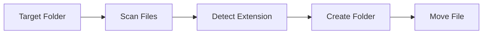

# Smart File Organizer

A lightweight Python utility that automatically organizes files into categorized folders based on their file extensions.

## ✨ Highlights

- 📂 Automatic file organization
- 🐍 Pure Python implementation
- ⚡ Lightweight and easy to use
- 📁 Extension-based categorization
- 🛡️ Basic error handling

## 📖 Overview

Smart File Organizer is a simple automation tool that scans a directory and automatically moves files into categorized folders based on their file extensions.

The project demonstrates practical file system automation using Python and serves as a foundation for more advanced file management applications.

## 🏗️ Architecture


## 🚀 Features

- Scan files inside a directory
- Detect file extensions
- Automatically create destination folders
- Move files into categorized folders
- Basic exception handling

## 🛠️ Tech Stack

- Python
- pathlib
- shutil
- os

## 📚 Academic Context

Originally developed as part of **CS351 – AI-Assisted Software Development** at Yuan Ze University.

The complete coursework repository is available here:

👉 https://github.com/WaterMinh/11402_CS351

## How to run
```bash
python3 main.py
